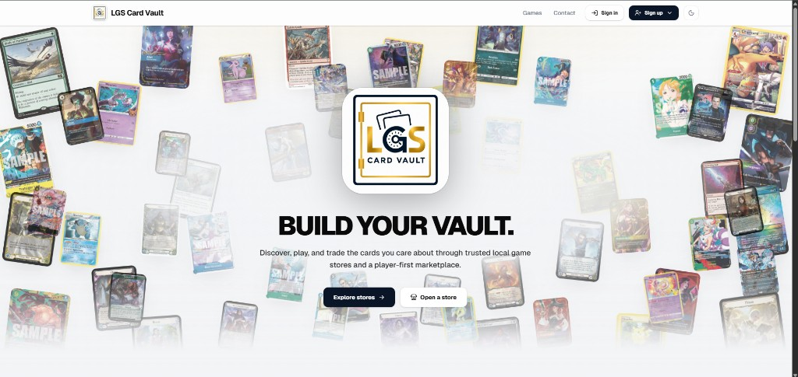

# LGS Card Vault



Player-first marketplace and store ops for local game stores — discover, stock, and trade Magic, Pokémon, One Piece, and more through trusted LGS storefronts.

## What it is

- **Storefronts** — branded multi-tenant shops with inventory, cart, and Square checkout
- **Catalog** — multi-game card data (Scryfall + TCGCSV) with search and CSV bulk import
- **Owners & shoppers** — subscriptions, orders, want lists, and platform admin
- **Commander deck builder** — strategy-aware recommendations learned from real decklists

## Stack

Symfony 8 + API Platform · React 19 + Vite · PostgreSQL · Square · Symfony Messenger

## Docs

| Doc | Contents |
|-----|----------|
| [architecture/](architecture/README.md) | Feature flowcharts (frontend → API → DB) |
| [architecture/commands.md](architecture/commands.md) | Console & worker command cheat sheet |
| [architecture/local-development.md](architecture/local-development.md) | Local setup, Square sandbox, testing, prod config |
| [deploy/LAUNCH.md](deploy/LAUNCH.md) | Go-live checklist |
| [deploy/RUNBOOK.md](deploy/RUNBOOK.md) | Day-two ops |

## Quick start

```bash
docker compose up -d
cd backend && composer install
php bin/console lexik:jwt:generate-keypair --skip-if-exists
php bin/console doctrine:migrations:migrate --no-interaction
php bin/console app:seed
php -S 127.0.0.1:8000 -t public   # terminal 1
php bin/console messenger:consume async -vv   # terminal 2
cd ../frontend && npm install && npm run dev  # terminal 3
```

Or use `./start-dev.sh` / `.\start-dev.ps1` after the one-time bootstrap. Full guide: [local development](architecture/local-development.md).

Open **http://localhost:5173** · API docs **http://127.0.0.1:8000/api/docs**
