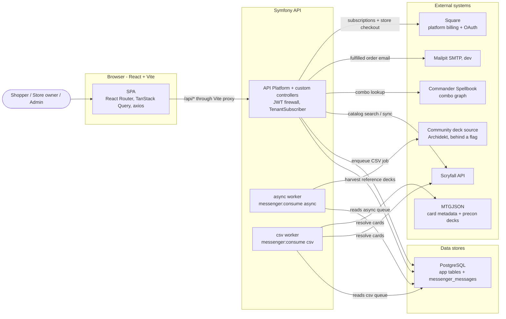

# Architecture

End-to-end maps of **LGS Card Vault**, from the React page a user clicks, through the HTTP route, backend entry point, services, repositories, and database rows.

Each feature doc pairs flow diagrams with a "where to go" table listing the exact classes/files at each layer.

Product overview: [root README](../README.md).

## How to read these docs

Every request generally flows through these layers:

| Layer | What lives here | Backend location |
|-------|-----------------|------------------|
| Frontend | React page -> hook -> axios call | `frontend/src/` |
| HTTP route | Method + path | Symfony controller `#[Route]` or API Platform `uriTemplate` |
| Backend entry | Controller action or API Platform provider/processor | `src/Controller/`, `src/State/` |
| Service | Business logic, external APIs | `src/Service/` |
| Repository -> DB | Doctrine queries and row mutations | `src/Repository/`, PostgreSQL |

Two backend styles coexist:

- Custom controllers in `src/Controller/*` for auth, store settings, payment connections, customer account features, CSV import, and customer notifications.
- API Platform resources for entities such as `Store`, `InventoryItem`, and `Order`, with state providers/processors in `src/State/`.

## Feature index

| Domain | What it covers | Doc |
|--------|----------------|-----|
| **Data model** | Tables, columns, foreign keys, ER diagram, and the multi-tenancy pattern | [data-model.md](data-model.md) |
| **Auth & tenancy** | Login, register, `/me`, JWT mechanics, role-based access, and tenant SQL filtering | [auth-and-tenancy.md](auth-and-tenancy.md) |
| **Stores & branding** | Public store directory, storefront by slug, branding/theme editor, store payment connections, platform admin | [stores-and-branding.md](stores-and-branding.md) |
| **Payments & billing** | Platform subscriptions (owner → marketplace), store checkout (shopper → store), renewals/dunning, admin billing dashboard | [payments-and-billing.md](payments-and-billing.md) |
| **Catalog & inventory** | Card catalog search, inventory browse, inventory CRUD, Scryfall bulk sync, card details, spotlight | [catalog-and-inventory.md](catalog-and-inventory.md) |
| **Case cards** | Owner-curated storefront sections filled manually or auto-pulled by price/rarity from inventory | [case-cards.md](case-cards.md) |
| **Commander deck builder** | Reference-deck harvesting, strategy classification, card relationships, contextual scoring, and 100-card construction | [commander-deck-builder.md](commander-deck-builder.md) |
| **CSV import** | Async bulk import lifecycle, failed-row recovery, card resolution, inventory writes, and live polling | [csv-import.md](csv-import.md) |
| **Customers & orders** | Per-store customer profiles, favorites, want lists, cart, test checkout, order workflow, notifications, and reports | [customers-and-orders.md](customers-and-orders.md) |
| **Launch compliance** | US pickup-only launch: SaaS copy, licenses, DOB, cookies, CCPA queue, $0-tax card block, disputes — and what is still lawyer/operator work | [compliance.md](compliance.md) |

## Ops & developer guides

| Doc | What it covers |
|-----|----------------|
| **[Commands](commands.md)** | Every `app:*` console command, Messenger workers, deploy helpers |
| **[Local development](local-development.md)** | Prerequisites, quick start, Square sandbox, catalog/Scryfall sync, testing, production config, troubleshooting |

### Production workers

| Service | Transport | What it runs |
|---------|-----------|--------------|
| `worker` | `async` | Archidekt / commander intelligence, catalog syncs, prune |
| `worker_import` | `csv` | Store CSV inventory uploads |
| `scheduler` | `scheduler_*` | Dispatches recurring catalog, billing, and commander jobs |

Steady state after harvest (one async worker + one import worker):

```bash
docker compose -f deploy/docker-compose.prod.yml --env-file /etc/mtgstore/prod.env up -d \
  --scale worker=1 --scale worker_import=1
```

Scale `worker_import` higher when many stores upload at once. Full table: [commands.md](commands.md).

## System context



## Recurring patterns worth knowing

- **Multi-tenancy** - `TenantSubscriber` reads `{slug}` from `/api/stores/{slug}/*`, resolves the `Store`, and enables a Doctrine SQL filter that scopes `InventoryItem` and `Order` queries by `store_id`. `/api/admin/*` routes disable the filter so super-admins see everything.
- **Create-on-write** - customer profile, favorites, and want-list reads never create rows. The `StoreCustomer` row is created lazily on the first write.
- **Card resolution cascade** - local DB -> Scryfall -> MTGJSON, used by catalog search, CSV import, and failed-row recovery.
- **Precompute, then score** - the commander deck builder harvests and aggregates reference decks in a Messenger worker, so a recommendation request only does indexed reads plus in-memory scoring of the user's own deck. See [commander-deck-builder.md](commander-deck-builder.md).
- **Provider abstraction for external data** - community decklists sit behind `DeckDataProviderInterface`, so swapping or disabling a source never touches scoring or deck construction.
- **Batched async import** - the CSV worker claims rows with `SELECT ... FOR UPDATE SKIP LOCKED`, processes 25 at a time, and self-dispatches the next batch.
- **Persisted notifications** - customer notifications are stored in `customer_notifications`; Mailpit email is a delivery side effect. The frontend currently polls every 15 seconds.
- **Two Square money paths** - the platform bills store owners with its own access token; each store charges shoppers through a connected OAuth account. See [payments-and-billing.md](payments-and-billing.md).
- **Launch compliance is mixed software + counsel** - pickup-only US stores, license intake, tax-ready card checkout, and privacy requests live in the app; facilitator analysis, entity formation, and Square production go-live do not. See [compliance.md](compliance.md).
- **Provider-owned payments** - payment provider credentials belong to the store connection in `store_payment_accounts`; the API never returns provider tokens.

## Local development dependencies

- PostgreSQL stores application data and the Messenger queue table.
- Mailpit receives local fulfillment emails on SMTP port `1025`; its UI runs on `http://localhost:8025`.
- Square is optional locally. Without credentials, subscription and checkout UIs run in mock mode; `POST /customer/test-order` still places unpaid pending orders for fulfillment testing.
