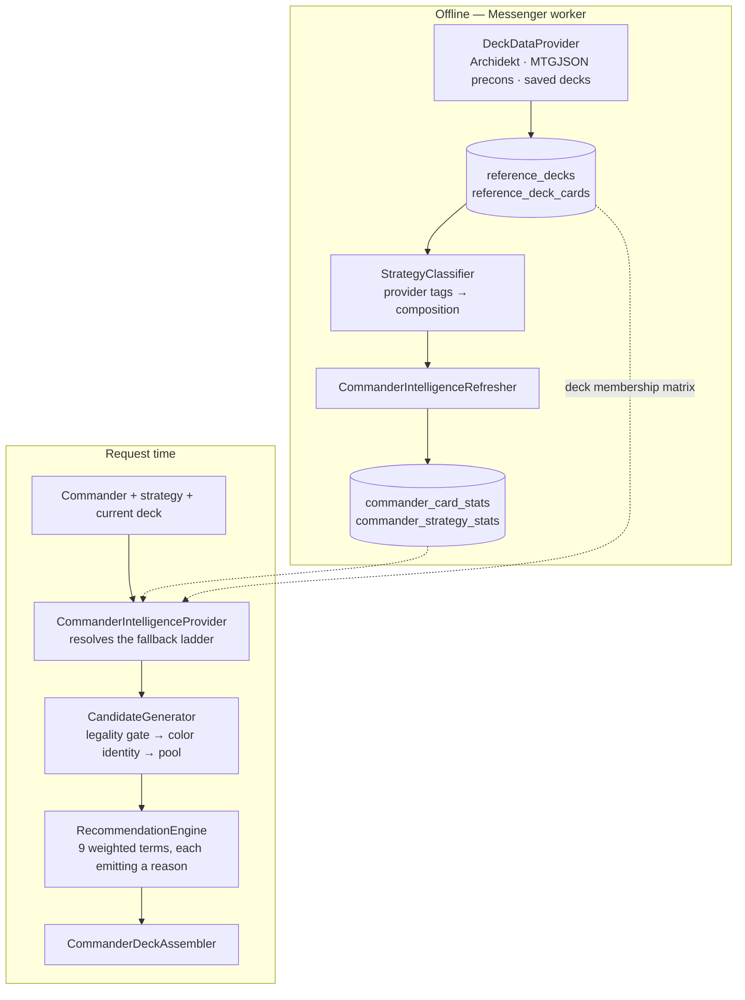

# Commander deck builder & synergy engine

How the deck builder answers *"given this commander, this strategy, and these
cards already in the deck, what makes this specific deck better?"* — as opposed
to *"what cards are popular?"*

The pipeline:

```text
Commander → Strategy → Reference decks → Card relationships
          → Existing deck → Best next cards → 100-card deck
```

## The two halves

Everything expensive happens offline. A recommendation request does a couple of
indexed reads plus in-memory scoring of the user's own deck.



## Where to go

| Layer | Class / file |
|-------|--------------|
| Frontend page | `frontend/src/pages/CommanderSynergyPage.tsx` |
| Frontend hooks | `frontend/src/hooks/useCommanderRecommend.ts` |
| HTTP routes | `src/Controller/CommanderRecommendController.php` |
| Strategy vocabulary | `src/Service/Recommend/Intelligence/StrategyTaxonomy.php` |
| Per-card role rules | `src/Service/Recommend/StrategyCatalog.php` |
| Deck classification | `src/Service/Recommend/Intelligence/StrategyClassifier.php` |
| Deck sources | `src/Service/Recommend/Provider/` |
| Offline aggregation | `src/Service/Recommend/Intelligence/CommanderIntelligenceRefresher.php` |
| Read-side + fallbacks | `src/Service/Recommend/Intelligence/CommanderIntelligenceProvider.php` |
| Card relationships | `src/Service/Recommend/Intelligence/SynergyEngine.php` |
| Candidate funnel | `src/Service/Recommend/Intelligence/CandidateGenerator.php` |
| Legality gate | `src/Service/Recommend/Intelligence/CommanderLegalityValidator.php` |
| Scoring | `src/Service/Recommend/Intelligence/RecommendationEngine.php` |
| Deck construction | `src/Service/Recommend/CommanderDeckAssembler.php` |
| Weights & toggles | `config/packages/commander_intelligence.yaml` |

## HTTP routes

All under `/api/stores/{slug}/recommend`.

| Route | Purpose |
|-------|---------|
| `GET /commanders?q=` | Commander typeahead from the local `commanders` table |
| `GET /commander/{cardId}/strategies` | Strategy picker, with real deck counts |
| `GET /commander/{cardId}?strategy=&limit=` | Recommendations for a strategy |
| `POST /commander/{cardId}/next-cards` | Recommendations given the current deck |
| `GET /commander/{cardId}/combos` | Spellbook combos ∩ store stock |
| `GET /commander/{cardId}/deck?strategy=&budgetCents=&maxCardCents=&bracket=` | 100-card build |

## Data sources

**MTGJSON** is normalized card metadata and Wizards' preconstructed decklists. It
is explicitly *not* a source of community popularity: `DeckList.json` holds only
published products, of which about 190 are Commander precons, with no view counts
or archetype tags. That is why community decks live behind a separate interface.

**`DeckDataProviderInterface`** is the seam that keeps everything downstream
provider-independent. Implementations are merged by `CompositeDeckDataProvider`,
and a provider that fails or is disabled degrades data volume rather than
breaking deck building.

| Provider | Notes |
|----------|-------|
| `ArchidektDeckDataProvider` | Richest source: oracle ids on every card row and builder-authored strategy tags. Undocumented API, and their terms grant a personal, noncommercial license only — gated behind `ARCHIDEKT_ENABLED`, throttled to 1 req/s, cached a week. |
| `MtgJsonPreconDeckProvider` | Thin but risk-free. Most commanders have zero or one precon. |
| `LocalDeckDataProvider` | Decks our own users saved. No third-party terms, and it compounds over time. |

Archidekt's `commanderName` filter matches decks that merely *contain* the named
card, so every deck is re-verified against its own Commander category before it
is kept. Skipping that check fills the reference pool with the wrong archetype.

## Scoring model

Weights live in `config/packages/commander_intelligence.yaml` and are injected as
`RecommendationWeights`. The sum is normalized, so output stays 0..1 however the
model is tuned. Legality is a hard gate during candidate generation, never a
weight.

| Weight | Default | Question it answers |
|--------|---------|---------------------|
| `strategy_affinity` | 0.26 | Is this card good for *this strategy*? |
| `existing_deck_synergy` | 0.16 | Does it work with what is already picked? |
| `role_need` | 0.14 | Does the deck still need this role? |
| `relationship` | 0.12 | How strongly is it tied to the deck's core? |
| `reference_frequency` | 0.10 | How often do real decks play it? |
| `package_completion` | 0.08 | Does it finish a half-built engine? |
| `commander_affinity` | 0.07 | Is it good with this commander generally? |
| `mana_curve` | 0.04 | Does it fit the curve? |
| `popularity` | 0.03 | EDHREC rank |

Popularity is deliberately last. Strategy fit carries more weight than commander
affinity and popularity combined, which is what stops format staples from
dominating a themed build.

Stock is applied *after* the weighted sum as a small bonus, so what a store
happens to have on the shelf breaks ties between comparable cards but never
reorders strategy fit. Out-of-stock cards are still recommended and flagged.

## Three ideas worth understanding

**Strategy affinity is specificity, not inclusion.** Sol Ring is in ~100% of a
commander's token decks *and* ~100% of its counters decks, so raw inclusion
cannot tell them apart. Affinity blends inclusion with lift against the
commander's own baseline: a card played twice as often inside a strategy as
outside it earns the bonus, while a universal staple has a lift of 1.0 and earns
nothing.

**Card relationships use lift, not co-occurrence.** Counting pairs would make
Sol Ring everything's best friend, since it appears alongside every card in every
deck. `lift(A,B) = P(A∧B) / (P(A)·P(B))` puts two independently popular cards at
1.0 and rewards only pairs that travel together more than their play rates
predict. The result is damped by support, so a two-of-three coincidence never
outranks an eight-of-ten pattern.

The co-occurrence matrix is always **commander-wide**, even when serving a single
strategy. Lift needs variance in the marginals: inside one strategy scope the
archetype's staples all sit near 100% inclusion, every pair computes to 1.0, and
the engine would conclude nothing is related to anything.

**There is no card-pair table.** Pairs are O(n²) per deck and would run to nine
figures of rows across every commander and strategy. Instead the reference decks
are read as a membership matrix — roughly 1,000 oracle ids for ten decks — and
relationships are computed in memory for just the candidate × current-deck pairs
that matter.

## Fallback ladder

Confidence and provenance travel with every response so the UI can be honest
about a thin sample rather than presenting two decks as authoritative.

```text
commander + exact strategy   (≥3 decks)
  → commander + related strategy
    → commander overall
      → strategy across all commanders
        → card metadata only
```

The last rung is the behaviour the recommender had before reference decks
existed, so a total provider outage degrades quality instead of breaking the
feature.

## Deck construction

`CommanderDeckAssembler` scores candidates, picks a small batch, re-scores
against the deck so far, and repeats. That is what makes later picks aware of
earlier ones — role need, package gaps, curve, and card relationships all shift
as the deck fills. `RecommendationEngine::prepare()` computes the static terms
once so re-scoring between picks stays cheap.

Two things are hard constraints rather than scoring preferences:

- **Legality** — singleton, color identity, and format legality are checked at
  pick time. Basic lands are the one exception to singleton.
- **Land count** — the slot budget is reserved. Scoring will always prefer
  another synergy piece to another land, so a purely score-driven build finishes
  at 99 cards with an unplayable mana base.

Structural targets come from the strategy, not a universal template: a landfall
deck wants more lands and ramp, a token deck fewer board wipes, an artifact deck
counts its mana rocks as both ramp and strategy density. Cards satisfy several
roles at once by design.

## Explanations

Reasons are recorded while each term is computed, never reconstructed afterwards.
That matters beyond honesty: a post-hoc explanation cannot be visibly wrong, so
it hides scoring bugs. Here the reasons *are* the scoring trace, and every
response also carries `scoreBreakdown` with each term's normalized contribution.

## Background processing

| Piece | Detail |
|-------|--------|
| `RefreshCommanderIntelligenceMessage` | Rebuild one commander, routed to `async` |
| `RefreshStaleCommanderIntelligenceMessage` | Weekly bounded fan-out for stale commanders |
| `PruneReferenceDecksMessage` | Weekly drop of orphaned reference decklists |
| `CommanderCatalogSchedule` | Catalog sync Sunday 06:00 UTC, intelligence sweep 08:00 UTC, prune 10:00 UTC |
| `app:commanders:intelligence` | Manual refresh: `--commander=` or `--top=N [--async]` |
| `app:commanders:prune-reference-decks` | Manual prune: `--batch=N [--async]` |

Workers must consume `scheduler_commanders` alongside `scheduler_catalog` and
`scheduler_billing`.

A cold commander is warmed lazily: the first request queues a refresh and is
served from the best available fallback rather than waiting on provider HTTP.

Warm the commanders that matter once after deploy:

```bash
php bin/console app:commanders:intelligence --top=400 --async
php bin/console messenger:consume async -vv
```

`CommanderIntelligenceProvider` and `CardProfileIndex` implement `ResetInterface`
because both memoize per request; without that a long-running worker would serve
stale aggregates until the process restarted.

Archidekt harvests fail open through a host-wide circuit breaker
(`ArchidektCircuitBreaker`): after consecutive transport/HTTP failures the
client skips Archidekt for a cool-down window so a blocked endpoint cannot stall
the worker. Other providers keep feeding the composite.

Reference deck *card rows* are a working set. The weekly prune deletes decks
whose `fetchedAt` is older than `prune_age_days` (default 120, above
`max_age_days` so the refresh sweep can retouch active commanders first). What
we keep long-term is the derived statistics tables.

## Backfill cost

About 3,500 legal commanders. Archidekt search is ordered by view count; we only
fetch the top `harvest_depth` decks (default 12). At two seconds per request, a
commander costs roughly half a minute (one search plus ~12 deck fetches), so a
few hundred finish in a few hours and the rest warm on first use. Refresh is far
cheaper: the search response carries `updatedAt` per deck, so only changed decks
need re-fetching.

## Tests

| File | Covers |
|------|--------|
| `tests/Service/Recommend/CommanderIntelligenceTest.php` | Strategy differentiation, staples vs strategy cards, deck context, relationships, legality, fallback ladder, provider failure |
| `tests/Service/Recommend/CommanderDeckAssemblerTest.php` | Exactly 100 cards, singleton, mana base, strategy affects the build, gap reporting |
| `tests/Service/Recommend/SynergyEngineTest.php` | Lift vs raw co-occurrence, support damping |
| `tests/Service/Recommend/ArchidektDeckDataProviderTest.php` | Mainboard extraction, commander verification, tag normalization |
| `tests/Service/Recommend/ArchidektCircuitBreakerTest.php` | Fail-open after consecutive failures, cool-down probe |
| `tests/Service/Recommend/ReferenceDeckPrunerTest.php` | Stale decks pruned, fresh decks retained |

`FakeArchidektClient` emits payloads in the real API's shape — nested
`card.oracleCard.uid`, per-card categories, deck categories with `includedInDeck`
flags — so the provider's real normalization runs under test and no test touches
the network.
