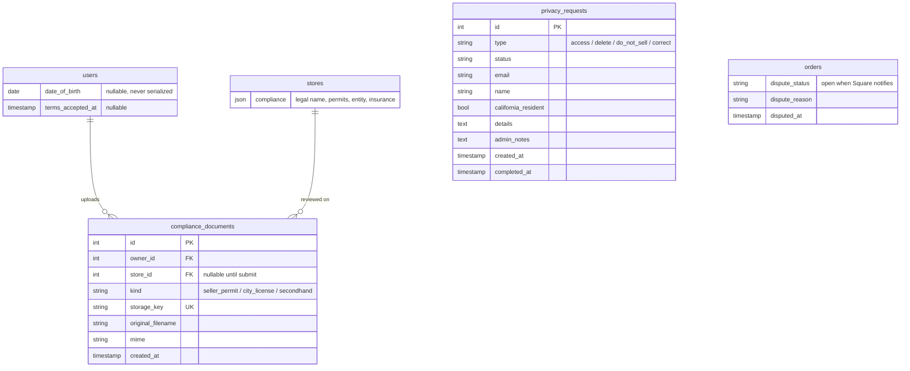
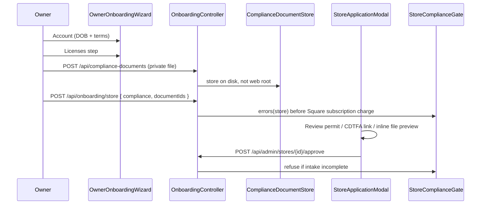
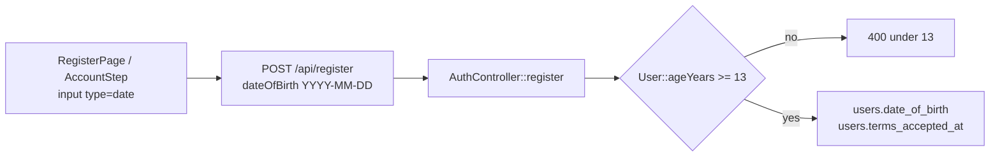
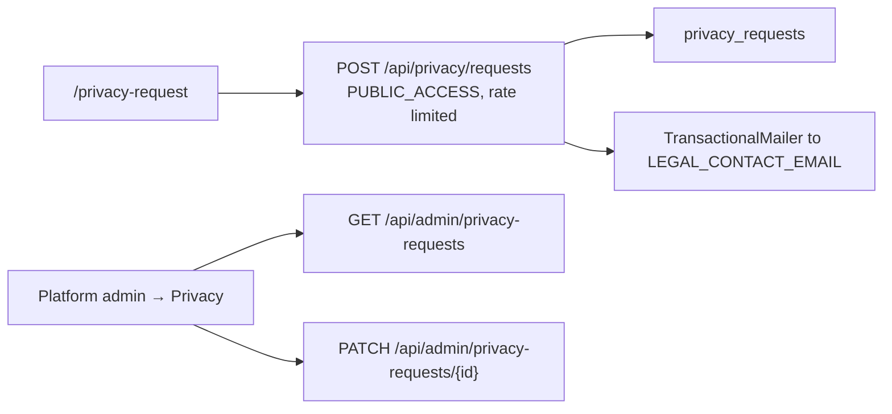
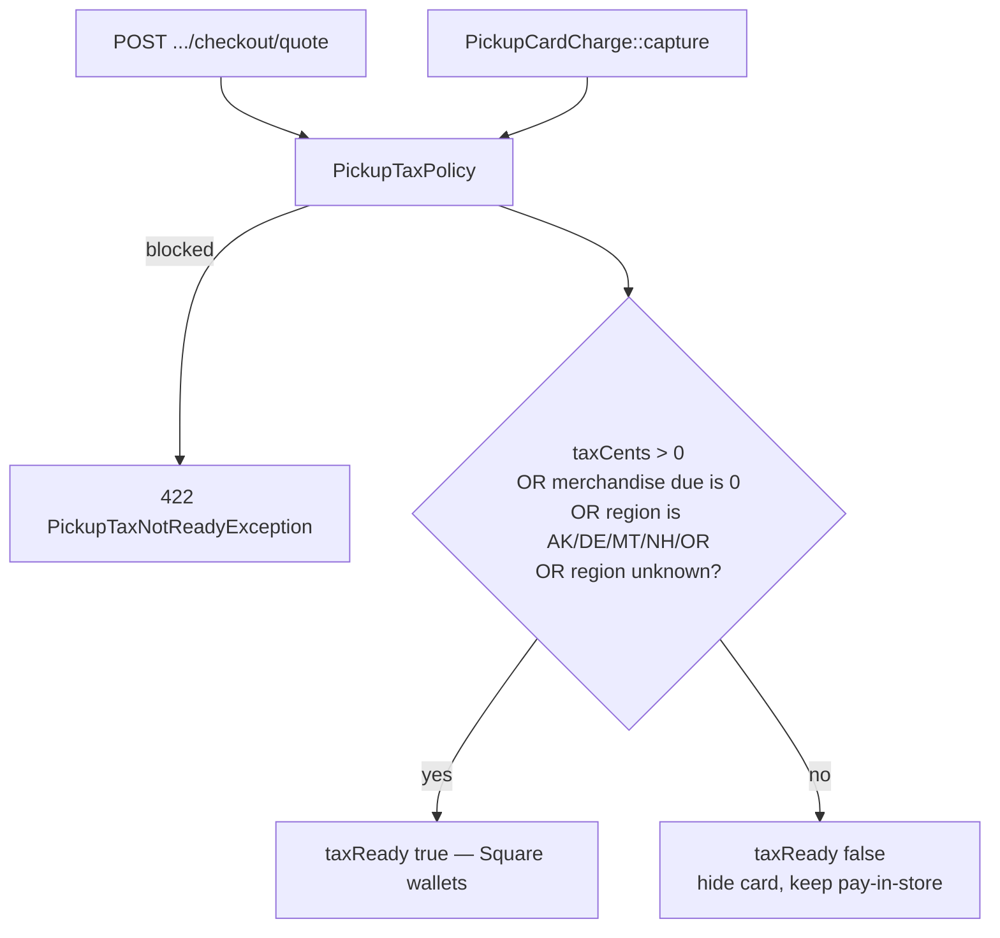
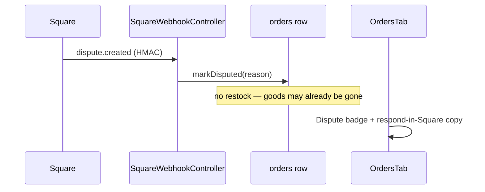

# Launch compliance

What LGS Card Vault **ships in the product** for a US-only, pickup-only, store-is-merchant launch — and what is still **operator / lawyer work** outside this repo.

Product overview: [root README](../README.md). Day-two launch steps: [deploy/LAUNCH.md](../deploy/LAUNCH.md). Payments money paths: [payments-and-billing.md](payments-and-billing.md). Tables: [data-model.md](data-model.md).

**In-app copy is not legal advice.** A lawyer still has to confirm the SaaS / not-marketplace-facilitator structure for your facts.

## Links into this repo

| What | URL |
|------|-----|
| GitHub repository | [Game-Store-Solutions/Lgscardvault](https://github.com/Game-Store-Solutions/Lgscardvault) |
| This slice (PR) | [#122 — pickup tax + launch compliance](https://github.com/Game-Store-Solutions/Lgscardvault/pull/122) |
| This file on the PR branch | [`architecture/compliance.md`](https://github.com/Game-Store-Solutions/Lgscardvault/blob/cursor/pickup-tax-launch-compliance-276b/architecture/compliance.md) |
| Go-live checklist | [`deploy/LAUNCH.md`](https://github.com/Game-Store-Solutions/Lgscardvault/blob/cursor/pickup-tax-launch-compliance-276b/deploy/LAUNCH.md) (Phase 3b) |
| Schema migration | [`backend/migrations/Version20260822210000.php`](https://github.com/Game-Store-Solutions/Lgscardvault/blob/cursor/pickup-tax-launch-compliance-276b/backend/migrations/Version20260822210000.php) |

Relative paths below work in the working tree and on GitHub when you open this file on the branch.

---

## Launch model (what the software assumes)

| Rule | How it is enforced |
|------|--------------------|
| United States storefronts only | Onboarding locks `country` to `US` and requires a valid state (`UsRegion`) |
| Pickup only — no shipping | Cart hides shipping; API rejects `fulfillment: shipping` |
| Each store is merchant of record | Shopper cards charge the store’s connected Square account |
| Platform is SaaS, not the seller | Stated on `/terms` and `/merchant-terms`; **not** a legal opinion |
| Sales tax at the store location | Square location tax on card checkout; **no-tax states (AK/DE/MT/NH/OR) still complete purchase at $0 tax**; pay-in-store collects at the counter |
| Card data never touches this app | Square Web Payments SDK tokenizes in the browser |

---

## What we have (shipped software)

Descriptions of the product behavior that already lives in this repository. Each item is **intake, gating, or display** — not a legal opinion and not a substitute for the operator checklist at the bottom.

| Capability | What it does | Primary code |
|------------|--------------|--------------|
| **Pickup-only checkout** | Cart and API refuse shipping. Fulfillment is in-store pickup. | [`PickupFulfillment.php`](../backend/src/Service/Checkout/PickupFulfillment.php) |
| **US storefronts** | Onboarding country is locked to `US`; region must be a real state/DC. | [`UsRegion.php`](../backend/src/Service/Onboarding/UsRegion.php) |
| **Square location tax** | Card checkout asks Square to auto-apply the connected location’s tax and stores `orders.tax_cents`. | [`PickupCardCharge.php`](../backend/src/Service/Checkout/PickupCardCharge.php) |
| **Tax-ready quotes** | `POST …/checkout/quote` returns `taxReady` / `taxBlockReason` so the UI can hide card pay. | [`StoreCustomerController.php`](../backend/src/Controller/StoreCustomerController.php), [`StoreGuestCheckoutController.php`](../backend/src/Controller/StoreGuestCheckoutController.php) |
| **$0-tax card block** | In a sales-tax state, card capture is refused when quoted **or final CreateOrder** tax is $0. Full store credit does not skip that gate. **AK / DE / MT / NH / OR complete card checkout with $0 tax.** Pay-in-store always stays. CreateOrder failure fails closed (no merchandise-only charge). | [`PickupTaxPolicy.php`](../backend/src/Service/Checkout/PickupTaxPolicy.php), [`StoreCheckoutGateway.php`](../backend/src/Service/Payments/StoreCheckoutGateway.php) |
| **Legal pages** | Public `/privacy`, `/terms`, `/pickup`, `/merchant-terms`, `/fan-content` — SaaS / store-is-seller copy. | [`LegalPage.tsx`](../frontend/src/pages/LegalPage.tsx) |
| **License intake** | Onboarding Licenses step: legal name, entity, EIN optional, seller’s permit number and/or private file, city/secondhand when they buy from the public, insurance attestation. | [`LicensesStep.tsx`](../frontend/src/pages/onboarding/steps/LicensesStep.tsx) |
| **Approve gate** | Submit and super-admin **approve** both call `StoreComplianceGate`. `enable()` only reactivates already-approved stores; admin `PATCH isActive` cannot skip review. | [`StoreComplianceGate.php`](../backend/src/Service/Compliance/StoreComplianceGate.php), [`StoreApprovalController.php`](../backend/src/Controller/StoreApprovalController.php) |
| **Private permit files** | PDF/JPEG/PNG/WebP under `var/share/compliance-docs/` (not web root). Owner or super-admin download only. Platform-admin review modal shows the file inline (image or PDF). | [`ComplianceDocumentStore.php`](../backend/src/Service/Compliance/ComplianceDocumentStore.php), [`StoreApplicationModal.tsx`](../frontend/src/pages/platform-admin/StoreApplicationModal.tsx) |
| **CA admin helper** | California applications show a CDTFA permits webpage link. **No scrape, no 50-state API.** | [`UsRegion::cdtfaVerifyUrl()`](../backend/src/Service/Onboarding/UsRegion.php) |
| **13+ date of birth** | Register, owner Account step, and **first Google SSO** require `dateOfBirth`. Under 13 is 400. DOB is stored and **never** returned in API JSON. | [`AuthController.php`](../backend/src/Controller/AuthController.php), [`SsoController.php`](../backend/src/Controller/SsoController.php) |
| **Cookie banner** | Necessary vs accept-all stored in `lgscv-cookie-consent`. `analyticsAllowed()` is the gate for any future pixel. | [`cookieConsent.ts`](../frontend/src/lib/cookieConsent.ts) |
| **Error boundary** | A render crash shows a reload/home screen instead of a blank white page. | [`ErrorBoundary.tsx`](../frontend/src/components/ErrorBoundary.tsx) |
| **Publisher takedown form** | `/fan-content` queues a `takedown` ticket (same admin queue as privacy). Mailbox still has to be watched. | [`PrivacyRequestForm.tsx`](../frontend/src/components/legal/PrivacyRequestForm.tsx) |
| **Privacy 45-day SLA** | Each ticket has `dueAt` / `overdue`. Admin sorts overdue first. `app:privacy:sla-remind` emails a digest. | [`PrivacyRequest.php`](../backend/src/Entity/PrivacyRequest.php) |
| **Chargeback runbook** | In-app dispute checklist (name, time, staff notes) plus [deploy/CHARGEBACKS.md](../deploy/CHARGEBACKS.md). You still respond in Square. | [`OrdersTab.tsx`](../frontend/src/pages/store-admin/OrdersTab.tsx) |
| **CCPA / privacy queue** | Public `/privacy-request` writes `privacy_requests`, emails `LEGAL_CONTACT_EMAIL`, rate limited. Super-admin list + PATCH. | [`PrivacyRequestController.php`](../backend/src/Controller/PrivacyRequestController.php) |
| **Chargeback flag** | Square `dispute.created` marks the order disputed and **does not restock**. Staff see a badge and “respond in Square” copy. | [`SquareWebhookController.php`](../backend/src/Controller/SquareWebhookController.php) |
| **Skip to content** | Skip link on app, admin, and auth shells targeting `#main-content`. | [`SkipToContent.tsx`](../frontend/src/components/layout/SkipToContent.tsx) |
| **PCI path** | Square Web Payments SDK tokenizes in the browser; this API only sees a `sourceId`. | [`SquarePaymentPanel.tsx`](../frontend/src/components/payments/SquarePaymentPanel.tsx) |

---

## Scorecard — original launch list

| Ask | In the repo today | Still missing (do this outside code) |
|-----|-------------------|--------------------------------------|
| Marketplace-facilitator analysis | Copy that we are SaaS / not the seller / not a facilitator | **Lawyer letter** confirming that for your entity and facts |
| Cookie / analytics consent banner | Necessary-cookies banner; preference in `localStorage` | No analytics pixels yet. If you add GA/Sentry browser SDK, gate it on “Accept all” |
| CCPA “Do Not Sell” beyond a policy email | Public form + `privacy_requests` table + admin queue | Human fulfillment within 45 days; California “Do Not Sell” link in the footer is the form, not a GPC signal parser |
| Age verification beyond a checkbox | Date of birth at signup, 13+ | **Not ID-checked.** No Persona/Stripe Identity. COPPA-shaped only |
| Seller’s permit upload / admin review | Number and/or private file; approve blocked until intake is complete | Human review. **No 50-state permit API.** CA admins get a CDTFA webpage link — do not scrape it |
| City license / pawn / secondhand | Onboarding fields + optional upload when the store buys/trades from the public | Local law still sits with the store; we do not look up city licenses |
| Accessibility (ADA / WCAG) | Skip-to-content; cookie notice (`role="region"`); privacy / takedown forms; root **ErrorBoundary** so a crash is not a white screen | **Not a WCAG 2.2 AA audit.** Hire a third party if you need ADA confidence |
| Wizards / Pokémon / fan-content | `/fan-content` notice + **takedown form** queued for admins | Follow publisher / retailer programs; **watch** the privacy queue and the legal mailbox |
| PCI / Square production checklist | Tokenize via Square; Payments tab + `LAUNCH.md` checklist | **You** finish Square production: OAuth redirect, webhooks, location tax, production credentials |
| Insurance, entity, EIN, registered agent | Store: legal name, entity type, optional EIN, insurance **attestation** | **Platform** entity, EIN, RA, and *your* insurance are operator work. We do not form companies |
| Chargeback / dispute SOPs | `dispute.created` persists; no auto-restock; order UI checklist + [CHARGEBACKS.md](../deploy/CHARGEBACKS.md) | Respond in **Square’s** dispute console with pickup proof |
| Privacy ops (45 days) | Queue + SLA dates + overdue badges + `app:privacy:sla-remind` | A human still has to fulfill the request |
| Analytics consent | `analyticsAllowed()` is true only after Accept all | Do not add a pixel that ignores this helper |
| Block checkout if Square tax is $0 | **Done in software.** Card checkout blocked in sales-tax states when quote tax is $0. **AK, DE, MT, NH, OR complete card (and pay-in-store) purchase with $0 tax.** Pay-in-store always available. | Enable location tax in Square Dashboard **for sales-tax states**. No-tax states do not need it to take cards. |

---

## Public pages (shopper / owner)

| URL | What it is | Source |
|-----|------------|--------|
| `/privacy` | Privacy policy (SaaS + CCPA pointer to the form) | [LegalPage.tsx](../frontend/src/pages/LegalPage.tsx) |
| `/privacy-request` | Access / delete / correct / **Do Not Sell** form | [PrivacyRequestForm.tsx](../frontend/src/components/legal/PrivacyRequestForm.tsx) |
| `/terms` | ToS — store is the seller | same `LegalPage.tsx` |
| `/pickup` | Pickup, refunds, chargebacks | same |
| `/merchant-terms` | Owner agreement — tax, licenses, PCI | same |
| `/fan-content` | Publisher marks / image-use notice | same |
| Footer | Legal + Do Not Sell links | [LegalLinks.tsx](../frontend/src/components/legal/LegalLinks.tsx) |

Operator identity on those pages comes from `GET /api/legal/site` (`LEGAL_ENTITY_NAME`, `LEGAL_CONTACT_EMAIL`, `LEGAL_ADDRESS`).

---

## Data added for this slice

Migration: [Version20260822210000.php](../backend/migrations/Version20260822210000.php)

- Compliance files live under `backend/var/share/compliance-docs/` (**not** `public/uploads`). PDF / JPEG / PNG / WebP, 8 MB.
- Date of birth is stored on `users` and **never** serialized (`GET /api/me` does not include DOB or an `ageVerified` flag). `User::isAgeVerified()` exists for server-side checks only.

---

## Flows

### Owner onboarding — licenses then admin approve

| Layer | Where |
|-------|-------|
| Frontend wizard | [LicensesStep.tsx](../frontend/src/pages/onboarding/steps/LicensesStep.tsx), [useOnboarding.ts](../frontend/src/pages/onboarding/useOnboarding.ts), [validation.ts](../frontend/src/pages/onboarding/validation.ts) |
| Admin review | [StoreApplicationModal.tsx](../frontend/src/pages/platform-admin/StoreApplicationModal.tsx) |
| Gate | [StoreComplianceGate.php](../backend/src/Service/Compliance/StoreComplianceGate.php) |
| Files | [ComplianceDocumentStore.php](../backend/src/Service/Compliance/ComplianceDocumentStore.php), [ComplianceDocumentController.php](../backend/src/Controller/ComplianceDocumentController.php) |
| Submit / approve | [OnboardingController.php](../backend/src/Controller/OnboardingController.php), [StoreApprovalController.php](../backend/src/Controller/StoreApprovalController.php) |
| States / CA link | [UsRegion.php](../backend/src/Service/Onboarding/UsRegion.php) (`cdtfaVerifyUrl()`) |

Required to **submit** and to **approve**: legal business name, entity type, insurance attestation, and either a seller’s permit (number or upload) **or** a no-statewide-sales-tax attestation in AK/DE/MT/NH/OR. Buy/trade requires a secondhand status (and a license number/file if they say they are licensed).

### Age gate (13+)

| Layer | Where |
|-------|-------|
| Frontend | [RegisterPage.tsx](../frontend/src/pages/RegisterPage.tsx), [AccountStep.tsx](../frontend/src/pages/onboarding/steps/AccountStep.tsx), [AuthContext.tsx](../frontend/src/context/AuthContext.tsx) |
| Backend | [AuthController.php](../backend/src/Controller/AuthController.php), [User.php](../backend/src/Entity/User.php) |

SSO / admin-created users are not forced through this form. That is a known software gap if you need every account DOB-gated.

### Cookie banner

[CookieConsentBanner.tsx](../frontend/src/components/CookieConsentBanner.tsx) — mounted in [App.tsx](../frontend/src/App.tsx). Keys `lgscv-cookie-consent` = `necessary` \| `all`. Today neither choice loads a tracker. Link to `/privacy-request`.

### CCPA / privacy-request queue

| Layer | Where |
|-------|-------|
| Form | [PrivacyRequestForm.tsx](../frontend/src/components/legal/PrivacyRequestForm.tsx) |
| Admin | [PrivacyRequestsPanel.tsx](../frontend/src/pages/platform-admin/PrivacyRequestsPanel.tsx) |
| API | [PrivacyRequestController.php](../backend/src/Controller/PrivacyRequestController.php) |
| Rate limit | `limiter.privacy_request` in [rate_limiter.yaml](../backend/config/packages/rate_limiter.yaml) |

### $0 Square tax — block card checkout

Unknown region is **not** blocked so fixture stores and admin-provisioned tenants keep working. A California store with Square tax off **is** blocked.

**No statewide sales tax (AK, DE, MT, NH, OR):** `taxReady` is true even when Square quotes $0. The shopper can finish paying by card. The quote `taxNote` says so instead of “sales tax is charged.” Local Square tax, if the location is configured for it, still applies and does not block.

| Layer | Where |
|-------|-------|
| Policy | [PickupTaxPolicy.php](../backend/src/Service/Checkout/PickupTaxPolicy.php) |
| Charge | [PickupCardCharge.php](../backend/src/Service/Checkout/PickupCardCharge.php) |
| Quote | [StoreCustomerController](../backend/src/Controller/StoreCustomerController.php), [StoreGuestCheckoutController](../backend/src/Controller/StoreGuestCheckoutController.php) |
| UI | [CheckoutPanel.tsx](../frontend/src/components/payments/CheckoutPanel.tsx), [CartPage.tsx](../frontend/src/pages/CartPage.tsx) |
| States list | [UsRegion.php](../backend/src/Service/Onboarding/UsRegion.php) `hasNoStateSalesTax()`, [config.ts](../frontend/src/pages/onboarding/config.ts) `NO_STATE_SALES_TAX` |

### Chargebacks

| Layer | Where |
|-------|-------|
| Webhook | [SquareWebhookController.php](../backend/src/Controller/SquareWebhookController.php) `handleDispute` |
| Order | [Order.php](../backend/src/Entity/Order.php) `markDisputed()` |
| Staff UI | [OrdersTab.tsx](../frontend/src/pages/store-admin/OrdersTab.tsx) |
| Shopper copy | `/pickup` on [LegalPage.tsx](../frontend/src/pages/LegalPage.tsx) |

Refunds from Square still restock via `refund.updated`. Disputes do not.

---

## HTTP surface

| Method | Path | Who |
|--------|------|-----|
| `POST` | `/api/register` | Public — now requires `dateOfBirth` + `acceptedTerms` |
| `POST` | `/api/onboarding/store` | Owner — `compliance` + `documentIds` |
| `POST` | `/api/compliance-documents` | Authenticated — multipart `kind` + `file` |
| `GET` | `/api/compliance-documents/{id}` | Owner or `ROLE_SUPER_ADMIN` — private download |
| `POST` | `/api/privacy/requests` | Public, IP rate limit |
| `GET` | `/api/admin/privacy-requests` | Super-admin |
| `PATCH` | `/api/admin/privacy-requests/{id}` | Super-admin |
| `POST` | `/api/admin/stores/{id}/approve` | Super-admin — refused if `StoreComplianceGate::errors` nonempty |
| `POST` | `/api/stores/{slug}/customer/checkout/quote` | Shopper — `taxReady` / `taxBlockReason` |
| `POST` | `/api/stores/{slug}/guest/checkout/quote` | Guest — same |

---

## Accessibility (what we did vs audit)

Shipped: skip link ([SkipToContent.tsx](../frontend/src/components/layout/SkipToContent.tsx)) on app, admin, and auth shells; `#main-content` targets; cookie banner `role="dialog"`; privacy and license forms use labeled `Input` / `Select`.

**Missing today:** a real WCAG 2.2 AA pass (contrast, keyboard, screen reader, captions). Treat the skip link as a start, not an ADA certificate.

---

## PCI and Square production (still yours)

Tokenization path is correct: [SquarePaymentPanel.tsx](../frontend/src/components/payments/SquarePaymentPanel.tsx) → Square SDK → `sourceId` on the API. This app must never log PAN/CVV.

Checklist UI: [PaymentsTab.tsx](../frontend/src/pages/store-admin/PaymentsTab.tsx). Operator steps: [LAUNCH.md Phase 3](../deploy/LAUNCH.md#phase-3--square-production).

Minimum webhooks: `oauth.authorization.revoked`, `refund.created`, `refund.updated`, `dispute.created`, `payment.created`.

---

## Permit APIs (do not integrate)

There is **no** supported 50-state seller’s-permit or city-license validation API. California [CDTFA permits & licenses](https://www.cdtfa.ca.gov/services/permits-licenses.htm) is a **manual webpage**. Admins get that URL for CA stores. Do not scrape it. If a state later publishes a real API whose ToS allows automated checks, add an optional verify button — the uploaded document remains the source of truth.

---

## Known software gaps (still in this repo, not counsel)

These are product holes, not “hire a lawyer” items:

| Gap | Why it is still open |
|-----|----------------------|
| No `ageVerified` on `/api/me` | DOB is write-only. The frontend cannot show “verified” from the session payload. |
| Admin-created / SSO users skip DOB | Only `POST /api/register` and the owner wizard Account step collect it. |
| No Global Privacy Control parser | Footer “Do Not Sell” is the `/privacy-request` form, not a GPC/`Sec-GPC` signal. |
| Unknown store region does not block $0 tax | Fixture and admin-provisioned tenants keep working; a live CA store with tax off **is** blocked. |
| Cookie banner does not load a pixel today | `analyticsAllowed()` is ready; nothing calls it yet. Adding a pixel that ignores it would be a regression. |
| No 50-state permit validator | Intentionally absent — see [Permit APIs](#permit-apis-do-not-integrate). |
| Not a WCAG certification | Skip link, labels, cookie dialog, ErrorBoundary — still not an audit. |

---

## Missing today (operator checklist)

Software for 6–10 and 12 is in the repo (forms, SLA, runbook, consent helper, ErrorBoundary). These remaining items are still **people / counsel / production config** — merging the PR does not finish them.

1. **Lawyer** — SaaS / not facilitator / not seller; review all six legal pages.
2. **Platform entity** — formation, EIN, registered agent, *your* business insurance.
3. **Env** — `LEGAL_ENTITY_NAME`, `LEGAL_CONTACT_EMAIL`, `LEGAL_ADDRESS` in `prod.env`.
4. **Square production** — OAuth redirect, production keys, webhooks, **location tax on every live store in a sales-tax state**. AK/DE/MT/NH/OR may take cards at $0 tax.
5. **Human permit review** — open the PDF, use the CDTFA link for California, reject incomplete applications.
6. **WCAG audit (still yours)** — we shipped skip-link, labeled forms, cookie dialog, ErrorBoundary. Hire a third party if you need ADA confidence.
7. **Publisher (watch the queue)** — takedown form exists on `/fan-content`. You still follow retailer/fan-content programs and action tickets.
8. **Privacy ops (staff it)** — 45-day due dates and `app:privacy:sla-remind` exist. A human still fulfills access/delete/DNS requests.
9. **Chargebacks (Square)** — runbook + in-app checklist exist. You still upload pickup proof in Square’s console.
10. **Ops hardening** — set `SENTRY_DSN`, off-host Postgres backups, uptime on `/health/ready` ([LAUNCH.md Phase 5](../deploy/LAUNCH.md)).
11. **Archidekt** — default is **off**. Do not set `ARCHIDEKT_ENABLED=1` until written permission.
12. **Analytics** — no pixel ships today. If you add one, call `analyticsAllowed()` and load it only when that is true.

---

## Tests

| File | Covers |
|------|--------|
| [PickupTaxPolicyTest.php](../backend/tests/Service/PickupTaxPolicyTest.php) | CA blocks $0 tax; AK/DE/MT/NH/OR (and names) do not — quote stays `taxReady` |
| [StoreComplianceGateTest.php](../backend/tests/Service/StoreComplianceGateTest.php) | Permit / no-tax attestation / buy-trade |
| [OnboardingStoreTest.php](../backend/tests/Controller/OnboardingStoreTest.php) | US + license intake on submit |
| [AdminActionsTest.php](../backend/tests/Controller/AdminActionsTest.php) | Approve refused without intake |
| [AuthEmailVerificationTest.php](../backend/tests/Controller/AuthEmailVerificationTest.php) | DOB required; under-13 rejected |
| [PrivacyRequestTest.php](../backend/tests/Controller/PrivacyRequestTest.php) | Public create + takedown + admin complete + SLA fields |
| [PrivacyRequestSlaTest.php](../backend/tests/Service/PrivacyRequestSlaTest.php) | 45-day due date / overdue / completed |

| [SquareCheckoutTest.php](../backend/tests/Controller/SquareCheckoutTest.php) | CA + $0 tax → 422; AK/DE/MT/NH/OR + $0 tax → 201 card capture |
| [GuestCheckoutTest.php](../backend/tests/Controller/GuestCheckoutTest.php) | Oregon guest card checkout completes at $0 tax |
| [SquareWebhookTest.php](../backend/tests/Controller/SquareWebhookTest.php) | Dispute persists, no restock |

---

## Related docs

| Doc | Why |
|-----|-----|
| [payments-and-billing.md](payments-and-billing.md) | Two Square money paths; webhooks |
| [auth-and-tenancy.md](auth-and-tenancy.md) | Register / JWT / roles |
| [stores-and-branding.md](stores-and-branding.md) | Store approval, public storefront |
| [customers-and-orders.md](customers-and-orders.md) | Cart and order workflow |
| [data-model.md](data-model.md) | Tables (see also the ER snippet above) |
| [deploy/LAUNCH.md](../deploy/LAUNCH.md) | Production Square + operator compliance |
| [deploy/CHARGEBACKS.md](../deploy/CHARGEBACKS.md) | Pickup-proof dispute steps |
| [deploy/prod.env.example](../deploy/prod.env.example) | `LEGAL_*`, `ARCHIDEKT_ENABLED=0`, Square env vars |
