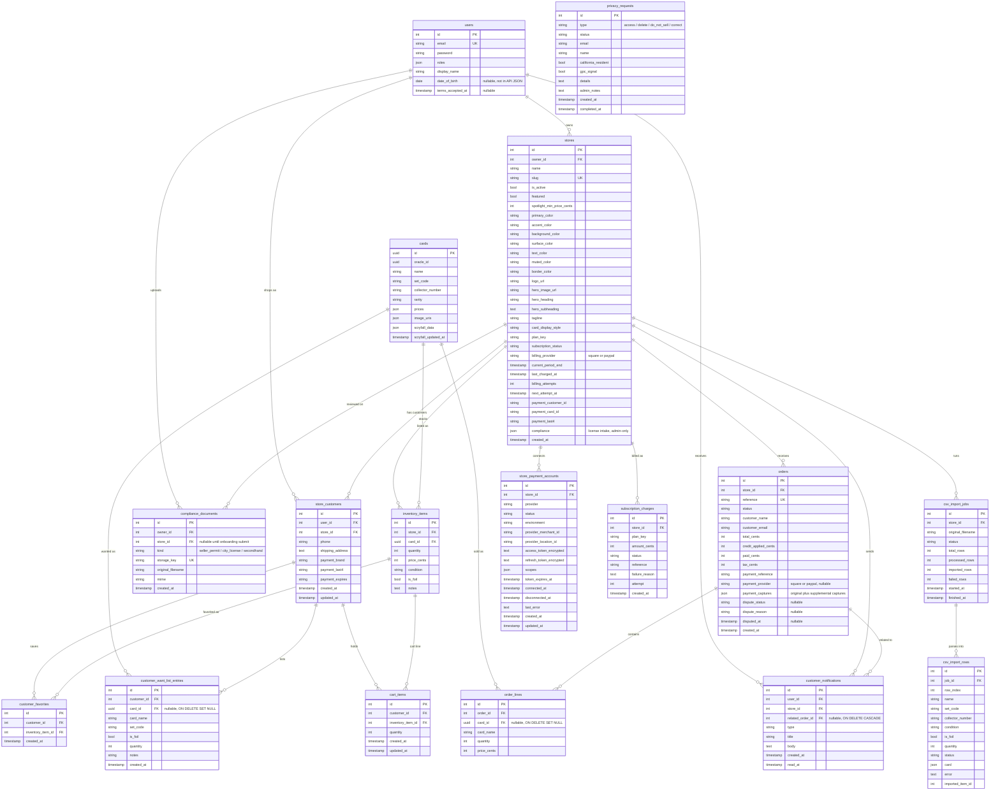

# Data model

PostgreSQL 16. Doctrine migrations in `backend/migrations/` create the schema. Card data uses UUID primary keys from Scryfall; most application-owned records use auto-increment integer IDs.

Launch-compliance tables (`stores.compliance`, `compliance_documents`, `privacy_requests`, DOB, order tax/disputes) are explained in [compliance.md](compliance.md).

## Entity relationship diagram

`messenger_messages` is not shown. It is the Symfony Messenger Doctrine transport table used by async CSV import jobs.

## Multi-tenancy pattern

The tenant discriminator is `store_id`.

| Group | Tables | How they are scoped |
|-------|--------|---------------------|
| Tenant root | `stores` | Resolved from the URL slug |
| Directly scoped | `inventory_items`, `orders`, `csv_import_jobs`, `store_customers`, `store_payment_accounts`, `subscription_charges`, `customer_notifications`, `compliance_documents` (nullable `store_id` until onboarding submit) | Have a `store_id` column. `inventory_items` and `orders` are additionally enforced by `TenantFilter` at the SQL level. Compliance files are owner-or-super-admin, not tenant-filtered SQL. |
| Transitively scoped | `order_lines`, `csv_import_rows`, `cart_items`, `customer_favorites`, `customer_want_list_entries` | Reached through a directly scoped parent |
| Global/shared | `users`, `cards`, `privacy_requests` | `users` are global identities; `cards` is the shared catalog; privacy requests are platform-wide (super-admin queue), not store-scoped |

See [auth-and-tenancy.md](auth-and-tenancy.md#multi-tenancy-filter) for request-time filter behavior.

## Enums and constrained values

| Value set | Column | Values |
|-----------|--------|--------|
| `CardCondition` | `inventory_items.condition` | `NM`, `LP`, `MP`, `HP`, `DMG` |
| `OrderStatus` | `orders.status` | `pending`, `received`, `fulfilled`, `paid`, `shipped`, `completed`, `cancelled`, `refunded` |
| Card display style | `stores.card_display_style` | `gallery`, `marketplace` |
| Payment provider | `store_payment_accounts.provider` | `square`, `paypal` |
| Order payment provider | `orders.payment_provider` | `square`, `paypal`, or null (pay-in-store / legacy) |
| Platform billing provider | `stores.billing_provider` | `square`, `paypal` |
| Payment status | `store_payment_accounts.status` | `connected`, `disconnected`, `error` |
| Subscription status | `stores.subscription_status` | `inactive`, `payment_required`, `active`, `past_due`, `suspended` |
| Subscription charge | `subscription_charges.status` | `paid`, `failed` |
| Notification type | `customer_notifications.type` | `order_fulfilled`, `order_balance_due`, `want_list_match`, `sell_trade_accepted`, `sell_trade_declined`, `sell_trade_completed` |
| Compliance document kind | `compliance_documents.kind` | `seller_permit`, `city_license`, `secondhand` |
| Privacy request type | `privacy_requests.type` | `access`, `delete`, `do_not_sell`, `correct` |
| Privacy request status | `privacy_requests.status` | `received`, `in_progress`, `completed`, `rejected` |

## Key constraints

- `users.email` is unique.
- `stores.slug` is unique.
- `inventory_items` is unique on `(store_id, card_id, condition, is_foil)`, so each store has one inventory line per card/condition/foil combination.
- `orders.reference` is unique and generated as `ORD-xxxxxxxx`.
- `store_customers` is unique on `(user_id, store_id)`, giving one customer profile per user per store.
- `cart_items` is unique on `(customer_id, inventory_item_id)`.
- `customer_favorites` is unique on `(customer_id, inventory_item_id)`.
- `store_payment_accounts` is unique on `(store_id, provider)`.
- `customer_notifications` indexes user/store/order lookups for the notification bell and order fulfillment dedupe.
- `cards` is indexed on `name` and `oracle_id`, plus two scaling indexes (migration `Version20260718090000`):
  - `idx_card_set_collector` on `(LOWER(set_code), LOWER(collector_number))` — the **natural key of a printing**. Import resolution matches on this (indexed, exact) instead of scanning by name substring, so lookups stay fast as the catalog grows toward every MTG printing.
  - `idx_card_name_trgm`, a `pg_trgm` GIN index on `LOWER(name)` — makes the catalog's leading-wildcard `LIKE '%…%'` searches index-backed instead of sequential scans.
- `inventory_items` carries a `version` column (Doctrine optimistic lock) so concurrent quantity updates fail fast instead of silently losing stock, plus `idx_inventory_store_id_id` on `(store_id, id)` powering keyset (cursor) pagination of the storefront listing.
- `csv_import_rows` carries `claimed_at` (set when a worker claims the row) so job-completion logic can tell a crashed handler's abandoned rows from a live handler's in-flight rows and never double-imports (migration `Version20260718160000`).
- `orders` has `idx_orders_store_customer_email` on `(store_id, LOWER(customer_email))` for the bounded customer order-history lookup.

## Security-sensitive storage

- Store customer payment fields are metadata only: card brand, last4, and expiry. Full card numbers are not stored.
- `store_payment_accounts.access_token_encrypted` and `refresh_token_encrypted` hold provider tokens after encryption by `SecretCipher`.
- Payment status serialization intentionally excludes provider tokens.
- Platform subscription vault ids (`payment_customer_id`, `payment_card_id`) live on `stores` and are never returned by the API; only `payment_last4` and status are exposed to store owners / platform admins.
- `subscription_charges` is the month-over-month ledger for platform billing; `stores.current_period_end` is the current-state pointer the renewer uses.
- `users.date_of_birth` is collected at register (13+) and is **never** returned by the API.
- `stores.compliance` JSON is admin/owner intake (legal name, permits, entity, insurance attestation). It is not a public storefront field.
- `compliance_documents` files live under `backend/var/share/compliance-docs/` (not `public/uploads`); only the uploading owner or a super-admin may download.
- `privacy_requests` hold requester email and narrative for CCPA-style access / delete / do-not-sell / correct — super-admin only after create.
