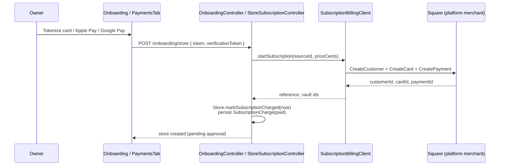
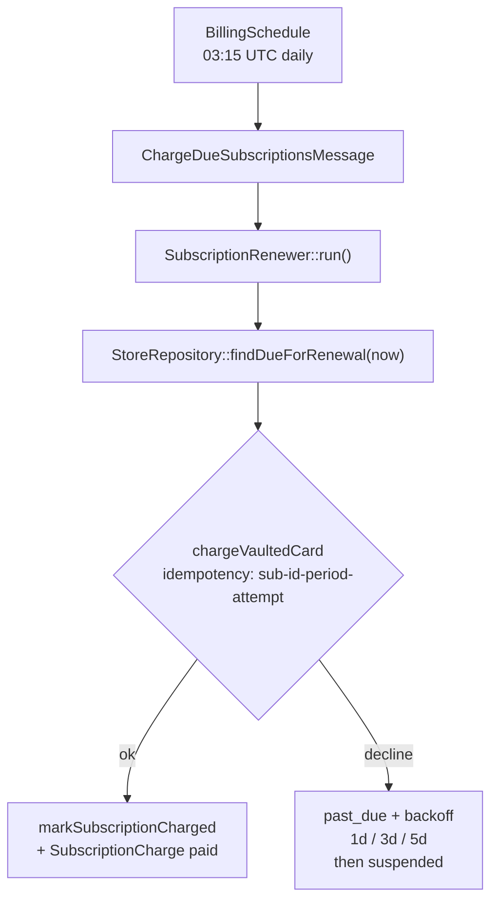
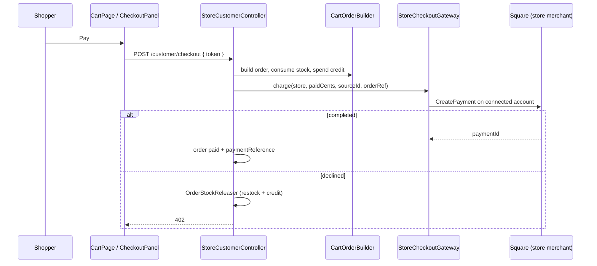
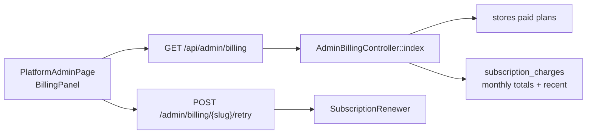

# Payments & billing

Two money paths never mix shopper funds with platform dues. Square remains the default; PayPal is an optional second processor with the same shape (connect per store, platform app for SaaS billing).

| Flow | Who pays | Merchant | Credentials |
|------|----------|----------|-------------|
| **Platform subscription** | Store owner → marketplace | The platform | Square `SQUARE_*_ACCESS_TOKEN` **or** platform PayPal `PAYPAL_*_CLIENT_*` |
| **Store checkout** | Shopper → store | Each connected store | Square OAuth **and/or** PayPal Partner Referral per store |

Sandbox and production keys live side by side (`SQUARE_SANDBOX_*` / `SQUARE_PRODUCTION_*`, `PAYPAL_SANDBOX_*` / `PAYPAL_LIVE_*`); `SQUARE_ENVIRONMENT` and `PAYPAL_ENVIRONMENT` select the pair.

The store is always merchant of record for shopper checkout. The platform never holds shopper funds. Do not route PayPal through Stripe — captures must settle to the store’s PayPal account.

| Feature | Route(s) |
|---------|----------|
| Onboarding client config | `GET /api/payments/onboarding/client-config` |
| Onboarding PayPal order | `POST /api/payments/onboarding/paypal/order` |
| Submit store application (charges first period) | `POST /api/onboarding/store` |
| Store subscription status / update method | `GET/POST /api/stores/{slug}/subscription[/payment-method]` |
| Store subscription PayPal vault order | `POST /api/stores/{slug}/subscription/paypal/order` |
| Charge due renewals (CLI) | `php bin/console app:subscriptions:charge` |
| Store Square connect / disconnect | `POST /api/stores/{slug}/payments/square/{connect,disconnect}` |
| Store PayPal connect / disconnect | `POST /api/stores/{slug}/payments/paypal/{connect,disconnect}` |
| Square OAuth callback | `GET /api/integrations/square/callback` |
| PayPal Partner callback | `GET /api/integrations/paypal/callback` |
| Shopper checkout config / charge | `GET/POST /api/stores/{slug}/customer/checkout[/config]` |
| Shopper PayPal order | `POST /api/stores/{slug}/{customer,guest}/checkout/paypal/order` |
| Platform billing dashboard | `GET /api/admin/billing`, `POST /api/admin/billing/{slug}/retry` |
| Square webhooks | `POST /api/integrations/square/webhook` |
| PayPal webhooks | `POST /api/integrations/paypal/webhook` |

---

## Platform subscription (owner → marketplace)

- Free plans (`starter`) skip the charge and keep a null `currentPeriodEnd`.
- Paid plans vault a Square customer + card on file **or** a PayPal vault id (`stores.billing_provider`), capture the first month, then set `currentPeriodEnd` one month ahead.
- Owners swap the method under **Store admin → Payments**; a new card or PayPal vault clears dunning backoff on `past_due` / `suspended`. Saving PayPal for an existing subscription captures **$0.01** to vault without collecting a full period early.

### Renewals and dunning

- A store is only charged once `currentPeriodEnd` has passed. Re-running the job the same day bills nothing.
- Each attempt uses a deterministic idempotency key so overlapping cron runs collapse into one Square payment.
- After three declines the store becomes `suspended` and is left alone until a human / new card intervenes.
- Manual collection: `POST /api/admin/billing/{slug}/retry` (super-admin) or `app:subscriptions:charge`.

| Layer | Where |
|-------|-------|
| Frontend | `pages/onboarding/steps/PaymentStep.tsx`, `pages/store-admin/PaymentsTab.tsx`, `components/payments/SquarePaymentPanel.tsx`, `components/payments/PaypalButtons.tsx` |
| Controllers | `OnboardingController`, `StoreSubscriptionController`, `AdminBillingController` |
| Services | `SubscriptionBillingClient`, `PaypalSubscriptionBilling`, `SubscriptionRenewer`, `SquareCredentials`, `PaypalCredentials` |
| Schedule | `Scheduler/BillingSchedule.php` → `messenger:consume scheduler_billing` |
| Repo/DB | `stores` (period + dunning columns), `subscription_charges` |

---

## Store checkout (shopper → store)

- Requires a connected Square account (`store_payment_accounts` provider `square`) with a location id **or** a connected PayPal merchant (`provider` `paypal`). Checkout config nests both (`enabled` + `paypal`).
- Order reference is the charge idempotency key. `orders.payment_provider` records `square` or `paypal`.
- Test/kiosk path (`POST /customer/test-order`) still places a pending order without charging.

PayPal checkout creates a Orders v2 order with `payee.merchant_id` set to the connected store, then captures that order id on `POST .../checkout`. Tax is quoted via Square when Square is connected; **$0 tax in a sales-tax state blocks PayPal the same as cards**. PayPal-only stores in a tax state cannot capture online (pay-in-store remains). No-tax states (AK / DE / MT / NH / OR) can complete at $0 tax.

**Usage-plan platform fees (5% until $450):** collected automatically on each shopper capture when the store is on the `usage` plan and has not met the cap. Square charges include `app_fee_money` on `CreatePayment` (routed to the platform Square application). PayPal orders include `payment_instruction.platform_fees` paid to `PAYPAL_*_PARTNER_MERCHANT_ID` (your platform PayPal merchant id). Progress is tracked on `stores.platform_fees_paid_cents`. Pay-in-store Square payment links do not currently support application fees — card checkout and PayPal are the fee-bearing paths.

Staff line edits do not touch PayPal until **Settle** (`POST .../payment-adjustment`). Removing cards issues one partial refund for the net credit. Adding cards cannot increase the original capture — the shopper approves one supplemental PayPal order from **Account → Orders** (registered) or the signed **email link** (`GET/POST .../guest/orders/{id}/…?token=…`). `orders.payment_captures` keeps every capture so a later full refund unwinds them all. Orders cannot move to ready/delivered while `balanceDueCents > 0`. Shrinking an order returns excess store credit to the customer's ledger automatically.

| Layer | Where |
|-------|-------|
| Frontend | `pages/CartPage.tsx`, `components/payments/CheckoutPanel.tsx`, `components/payments/PaypalButtons.tsx`, `pages/store-admin/OrdersTab.tsx` |
| Controller | `StoreCustomerController::checkout` / `checkoutConfig` / PayPal order; guest equivalents; `StoreOrderPaymentController` |
| Gateway | `StoreCheckoutGateway`, `PaypalCheckoutGateway` |
| OAuth | `SquareOAuthClient`, `PaypalPartnerClient`, `StorePaymentController` |
| Shared order logic | `CartOrderBuilder`, `OrderStockReleaser`, `OrderPaymentAdjuster` |
| Repo/DB | `orders.paid_cents`, `orders.payment_reference`, `orders.payment_provider`, `orders.payment_captures`, `store_payment_accounts` |

---

## Platform admin billing dashboard

Surfaces MRR (active paid plans), overdue value, collected-this-month, per-store status, monthly history, and a "Charge now" action for overdue stores.

| Layer | Where |
|-------|-------|
| Frontend | `pages/platform-admin/BillingPanel.tsx` |
| Route | `GET /api/admin/billing`, `POST /api/admin/billing/{slug}/retry` |
| Entry | `Controller/AdminBillingController.php` |
| Repo/DB | `StoreRepository`, `SubscriptionChargeRepository` |

---

## Webhooks (optional)

`POST /api/integrations/square/webhook` is implemented (HMAC verify, idempotent event log, refund / revoke / dispute handlers) but **not required for local use**. Square rejects `http://127.0.0.1` notification URLs; wire it at deploy time (or via a tunnel) with:

- `SQUARE_SANDBOX_WEBHOOK_SIGNATURE_KEY` / `SQUARE_PRODUCTION_WEBHOOK_SIGNATURE_KEY`
- `SQUARE_WEBHOOK_URL` matching the subscription URL exactly

Until those are set, the endpoint rejects every request.

`POST /api/integrations/paypal/webhook` verifies against `PAYPAL_*_WEBHOOK_ID` (cert verify in live; test bypass when the id is `test-paypal-webhook-id`). Handlers cover merchant revoke, refund/reverse, and dispute — **no auto-restock** on dispute. Return URL for Partner Connect: `PAYPAL_OAUTH_REDIRECT_URI` (default `/api/integrations/paypal/callback`).

---

## Known gaps

- Cancelling an order in store admin restocks **and** refunds the captured Square or PayPal payment.
- Checkout is **pickup only**. Shipping is hidden and rejected by the API.
- Pickup online checkout applies the store's Square location taxes (`auto_apply_taxes`) and charges the tax-inclusive total. In a sales-tax state, **$0 quoted tax blocks card and PayPal checkout** (pay-in-store stays). **AK / DE / MT / NH / OR can complete online checkout with $0 tax.** See [compliance.md](compliance.md).
- Apple Pay on Square needs a registered domain in the Square dashboard. PayPal Apple Pay / Google Pay appear when PayPal is connected and Square wallets are not already on the page. PayPal Apple Pay also needs the domain registered in the PayPal app (same `/.well-known/apple-developer-merchantid-domain-association` path Square uses — only one file can live there).
- Webhook deliveries need a public HTTPS URL (skipped locally for now).
- PayPal Partner Referrals require Commerce Platform / Partner access on the platform app.
