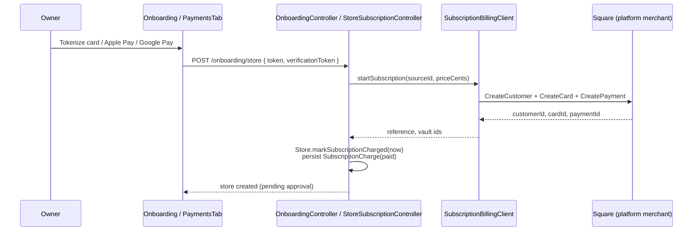
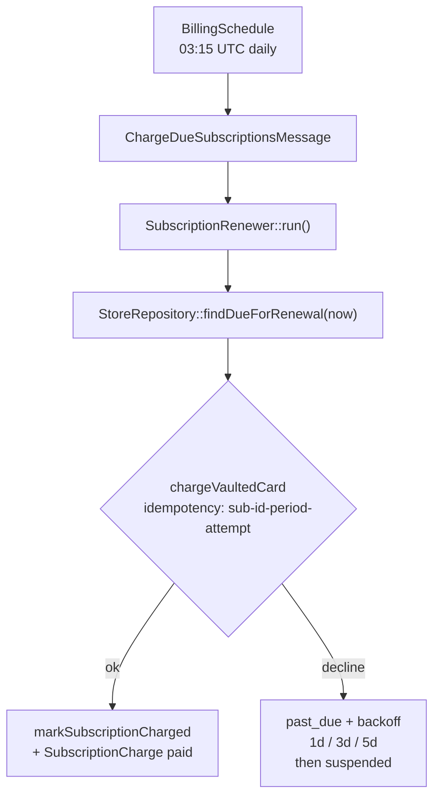
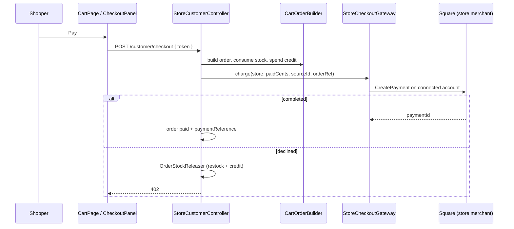
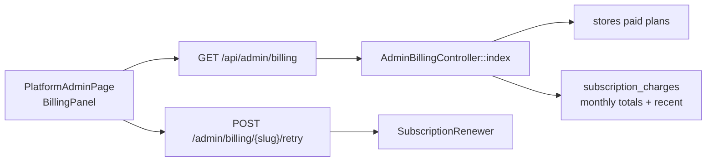

# Payments & billing

Two distinct Square integrations share one application but never share money:

| Flow | Who pays | Merchant | Credentials |
|------|----------|----------|-------------|
| **Platform subscription** | Store owner → marketplace | The platform | `SQUARE_*_ACCESS_TOKEN` + location |
| **Store checkout** | Shopper → store | Each connected store | Square OAuth per store |

Sandbox and production keys live side by side (`SQUARE_SANDBOX_*` / `SQUARE_PRODUCTION_*`); `SQUARE_ENVIRONMENT` selects the pair. Going live is a one-variable change, and a half-finished switch cannot send sandbox keys to the live API.

| Feature | Route(s) |
|---------|----------|
| Onboarding client config | `GET /api/payments/onboarding/client-config` |
| Submit store application (charges first period) | `POST /api/onboarding/store` |
| Store subscription status / update card | `GET/POST /api/stores/{slug}/subscription[/payment-method]` |
| Charge due renewals (CLI) | `php bin/console app:subscriptions:charge` |
| Store Square connect / disconnect | `POST /api/stores/{slug}/payments/square/{connect,disconnect}` |
| Square OAuth callback | `GET /api/integrations/square/callback` |
| Shopper checkout config / charge | `GET/POST /api/stores/{slug}/customer/checkout[/config]` |
| Platform billing dashboard | `GET /api/admin/billing`, `POST /api/admin/billing/{slug}/retry` |
| Webhooks (optional; skipped until configured) | `POST /api/integrations/square/webhook` |

---

## Platform subscription (owner → marketplace)

- Free plans (`starter`) skip the charge and keep a null `currentPeriodEnd`.
- Paid plans vault a Square customer + card on file, capture the first month, then set `currentPeriodEnd` one month ahead.
- Owners swap the card under **Store admin → Payments**; a new card clears dunning backoff on `past_due` / `suspended`.

### Renewals and dunning

- A store is only charged once `currentPeriodEnd` has passed. Re-running the job the same day bills nothing.
- Each attempt uses a deterministic idempotency key so overlapping cron runs collapse into one Square payment.
- After three declines the store becomes `suspended` and is left alone until a human / new card intervenes.
- Manual collection: `POST /api/admin/billing/{slug}/retry` (super-admin) or `app:subscriptions:charge`.

| Layer | Where |
|-------|-------|
| Frontend | `pages/onboarding/steps/PaymentStep.tsx`, `pages/store-admin/PaymentsTab.tsx`, `components/payments/SquarePaymentPanel.tsx` |
| Controllers | `OnboardingController`, `StoreSubscriptionController`, `AdminBillingController` |
| Services | `SubscriptionBillingClient`, `SubscriptionRenewer`, `SquareCredentials` |
| Schedule | `Scheduler/BillingSchedule.php` → `messenger:consume scheduler_billing` |
| Repo/DB | `stores` (period + dunning columns), `subscription_charges` |

---

## Store checkout (shopper → store)

- Requires a connected Square account (`store_payment_accounts`) with a location id.
- Order reference is the charge idempotency key.
- Test/kiosk path (`POST /customer/test-order`) still places a pending order without charging.

| Layer | Where |
|-------|-------|
| Frontend | `pages/CartPage.tsx`, `components/payments/CheckoutPanel.tsx` |
| Controller | `StoreCustomerController::checkout` / `checkoutConfig` |
| Gateway | `StoreCheckoutGateway` (implements `CheckoutGatewayInterface`) |
| OAuth | `SquareOAuthClient`, `StorePaymentController` |
| Shared order logic | `CartOrderBuilder`, `OrderStockReleaser` |
| Repo/DB | `orders.paid_cents`, `orders.payment_reference`, `store_payment_accounts` |

---

## Platform admin billing dashboard

Surfaces MRR (active paid plans), overdue value, collected-this-month, per-store status, monthly history, and a "Charge now" action for overdue stores.

| Layer | Where |
|-------|-------|
| Frontend | `pages/platform-admin/BillingPanel.tsx` |
| Route | `GET /api/admin/billing`, `POST /api/admin/billing/{slug}/retry` |
| Entry | `Controller/AdminBillingController.php` |
| Repo/DB | `StoreRepository`, `SubscriptionChargeRepository` |

---

## Webhooks (optional)

`POST /api/integrations/square/webhook` is implemented (HMAC verify, idempotent event log, refund / revoke / dispute handlers) but **not required for local use**. Square rejects `http://127.0.0.1` notification URLs; wire it at deploy time (or via a tunnel) with:

- `SQUARE_SANDBOX_WEBHOOK_SIGNATURE_KEY` / `SQUARE_PRODUCTION_WEBHOOK_SIGNATURE_KEY`
- `SQUARE_WEBHOOK_URL` matching the subscription URL exactly

Until those are set, the endpoint rejects every request.

---

## Known gaps

- Cancelling an order in store admin restocks **and** refunds the Square payment when one was captured.
- Checkout is **pickup only**. Shipping is hidden and rejected by the API.
- Pickup card checkout applies the store's Square location taxes (`auto_apply_taxes`) and charges the tax-inclusive total.
- Apple Pay needs a registered domain in the Square dashboard.
- Webhook deliveries need a public HTTPS URL (skipped locally for now).
